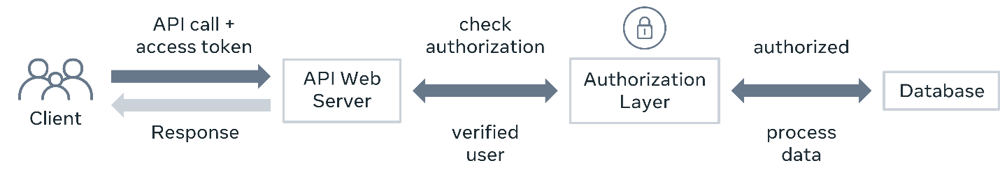

# Authentication versus authorization

You need to secure your APIs because they provide third-party clients access to your backend data. If you don’t secure your APIs properly, anyone can tamper with the data and access sensitive information. But even if a client is allowed to access the data, you need to control who can do what. This is where authentication and authorization come in. You now know that although they sound similar, they are not the same. In this reading, you will learn about the difference between authentication and authorization and how you can use it to protect your API endpoints.

## Authentication

Authentication is the process of verifying the credentials of a user. Logging into websites with a username and password is a typical example of authentication. When the username and password match, the website recognizes the user and sets some cookies in the user’s browser. When the user visits another page on that website, the browser sends those cookies within the HTTP request header. The website recognizes the cookies as well as server-side session data and therefore doesn’t ask for credentials until the user logs out again.

So, how does this work? Token-based authentication usually involves two steps in the API Architecture. First, the client identifies itself with a username and password. Then the API server gives it a bearer token. From there, the client includes the bearer token with every API call that it places. The API server verifies it and then allows the client to perform the action or not. This is where authorization comes in, but more on this later.

If the credentials are not valid, the client will receive a 401 - Unauthorized HTTP status code.

This is like coming to the office on the first day, submitting all your papers and documents, and then receiving your employee card. After that, only your employee card will be sufficient to get inside. Authentication works just like that!

The two steps in the API authentication process can be represented by the following two diagrams.

**Authentication process: Getting an access token**

**Authenticated API calls**

## Authorization

However, even with your employee card, you will not be able to access all the rooms or spaces in the office. There are some places that are only accessible to a certain group of people who have been given that privilege. Authorization is exactly like that. Authentication lets you in, authorization lets you act. It checks after authentication if the user has the proper privileges to perform some tasks.

On the server side, this is typically done by assigning the user to a group or a set of groups. Then, after verifying the token, the code checks if the user belongs to the appropriate group to perform that task. If not, the client will receive a 403 - Forbidden HTTP status code.

**API authorization**

